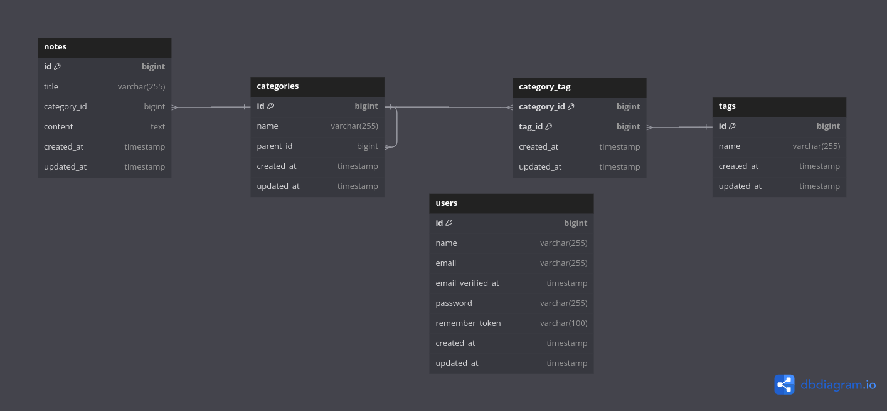
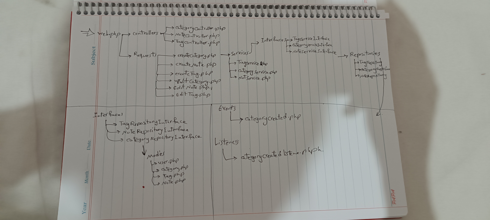

# Note project document
---
## Tables diagram

## Description for tables
### Relationships

1. **Relationship between `notes` and `categories` (many-to-one):**
   - Each note can belong to one category (nullable), while each category can have many associated notes. This allows categorization of notes based on different subjects.

2. **Self-referencing relationship in `categories` (many-to-one):**
   - This relationship allows for hierarchical categorization. Each category can have a parent category (another category higher up in the hierarchy), enabling nested categorization structures.

3. **Many-to-many relationship between `categories` and `tags` via `category_tag`:**
   - Enables each category to have multiple tags, and each tag to be associated with multiple categories. This flexibility allows tags to be used across different categories and vice versa.
---
## Structure this app

##run this command to create tables and fake data

`php artisan migrate`
`php artisan db:seed`
# note_project-main
